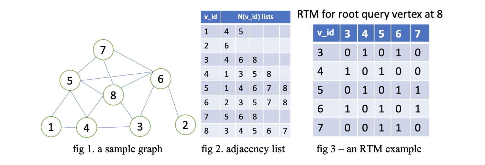

# CliqueX
Finding Maximal Cliques Fast

### Project Structure
- `src` directory contains the source code. 
    - `org_maximal_clique` contains the naive implementation.
    - `bp_maximal_clique` contains the current state-of-the-art implementation.
    - `loi_maximal_clique` contains the `CliqueX` implementation.

To switch between method, change the class type for the variable `mc` in `mc.cpp`.

Special thanks to Shuo Han, Lei Zou, and Jeffrey Xu Yu, who provided the [source code](https://github.com/pkumod/GraphSetIntersection) of the current state-of-the-art implementation.

- `data` contains the scripts for downloading data and reordering data.
- `paper` contains the research paper that builds the foundation of this project.

### Dependencies
Make sure your CPU support AVX2 instructions to achieve the best performance. (Intel is preferred)

### How to Run
In `src` directory run `make`. It will generate two binaries: `mc`, which is for maximal clique finding, and `reorder` which is for reordering the graph. 

To find maximal clique in a graph use:
> ./mc [ path to graph file ] [ path to output file]

For instance find maximal clique in `data/reactome`:
> ./mc ../data/reactome

### Graphs Included
The graph included is `reactome`: 
| Graph Name | Vertex Number | Edge Number | Triangle Count |
| --- | --- | --- | --- |
| reactome | 6,327 | 147,547 | 4,187,734 |

Note, the graph is reindexed so the vertex ids start from 0 and are contiguous. 

### Introduction
This project aims to find faster algorithm for finding maximal cliques in an undirected graph. Listing all maximal cliques is a NP hard problem. [Moon & Moser](https://link.springer.com/article/10.1007%2FBF02760024) have shown that every n-vertex graph has at most 3^(n/3) maximal cliques. 

They can be listed by the [Bron-Kerbosch algorithm](https://en.wikipedia.org/wiki/Bron–Kerbosch_algorithm). A recursive backtracking algorithm that is worst case optimal. 

Existing algorithms focus on speeding up maximal clique finding when its number is significant less than the worst case. Examples include [pivoting](https://en.wikipedia.org/wiki/Bron–Kerbosch_algorithm#With_pivoting), and [pivoting + ordering(degeneracy)](https://en.wikipedia.org/wiki/Bron–Kerbosch_algorithm#With_vertex_ordering) or [Tomita](https://snap.stanford.edu/class/cs224w-readings/tomita06cliques.pdf).

This project proposed a new DFS backtracking algorithm build on top of [Local Online Indexing (Loi)](./doc/LocalOnlineIndexing.pdf). `Loi` is a compact encoding of a vertex's triangles in binary format. It uses SIMD instructions to accelerate bitmap encoding and decoding. It uses bitwise AND operation to get set intersection instead of traditional vertex at a time approach. Simply put, it is designed to be cache friendly, SIMD friendly, and branchless.

### Bron-Kerbosch (1973) - Worst Case Optimal

The core part of Bron-Kerbosch algorithm consists of three arrays: R, P, and X.

R contains all vertexes the current DFS tree path.
P contains all vertexes that is connected to all vertex in R.
X contains all vertexes that has been fully explored.

Initially, R is empty, P contains all vertexes in the graph, and X is empty.

The algorithm goes like this:
```
algorithm BronKerbosch(R, P, X) is
    if P and X are both empty then
        report R as a maximal clique
    for each vertex v in P do
        BronKerbosch(R ⋃ {v}, P ⋂ N(v), X ⋂ N(v))
        P := P \ {v}
        X := X ⋃ {v}
```
This algorithm checks all cliques in the graph. It conducts a DFS on each vertex in the graph with backtracking. It keeps the vertexes that form a clique in R, using P and X to indicate if the clique in R is maximal.

If P is not empty, R can be enlarged by adding another vertex from P, so R is not maximal. If X is not empty, this clique in R must has been explored in the previous search, so it is also not maximal. That's why it reports R as maximal only when both P and X are empty.

### Pivoting Vertex (1973) - Do Less

This algorithm is inefficient. It needs to make a recursive call on every single clique. A remedy is to choose a pivoting vertex, and not visiting its neighbors at the current depth.

> Bron and Kerbosch introduced a variant of the algorithm involving a "pivot vertex" u, chosen from P (or more generally, as later investigators realized, from P ⋃ X). Any maximal clique must include either u or one of its non-neighbors, for otherwise the clique could be augmented by adding u to it. Therefore, only u and its non-neighbors need to be tested as the choices for the vertex v that is added to R in each recursive call to the algorithm. In pseudocode:

```
algorithm BK-Pivot(R, P, X) is
    if P and X are both empty then
        report R as a maximal clique
    choose a pivot vertex u in P ⋃ X
    for each vertex v in P \ N(u) do
        BK-Pivot(R ⋃ {v}, P ⋂ N(v), X ⋂ N(v))
        P := P \ {v}
        X := X ⋃ {v}
```

### Tomita (2006) - Do Even Less

If the pivot is chosen to minimize the number of recursive calls made by the algorithm, good things can happen.

In pseudocode:
```
algorithm Tomita(R, P, X) is
    if P and X are both empty then
        report R as a maximal clique

    choose u with Min |P \ N(u)|

    for each vertex v in P \ N(u) do
        Tomita(R ⋃ {v}, P ⋂ N(v), X ⋂ N(v))
        P := P \ {v}
        X := X ⋃ {v}
```

### Degeneracy (2011) - Plan Ahead, Do Much Less In the Future.

When visiting a vertex u with high degree, we hope that its candidate set P is small so it can be handled easily. To make P small, it means we need to visit many vertexes in N(u) before visiting u and we can remove them from P by the time visiting u. We can do this for one vertex easily. But if we want to achieve global optimal, we need to find an order for visiting each vertex and this is where degeneracy came into play.  

> The degeneracy of a graph G is the smallest number d such that every subgraph of G has a vertex with degree d or less. Every graph has a degeneracy ordering, an ordering of the vertices such that each vertex has d or fewer neighbors that come later in the ordering; a degeneracy ordering may be found in linear time by repeatedly selecting the vertex of minimum degree among the remaining vertices. 

If the order of the vertices v that the Bron–Kerbosch algorithm loops through is a degeneracy ordering, then the set P of candidate vertices in each call (the neighbors of v that are later in the ordering) will be guaranteed to have size at most d. The set X of excluded vertices will consist of all earlier neighbors of v, and may be much larger than d. In recursive calls to the algorithm below the top most level of the recursion, the pivoting version can still be used.

In pseudocode, the algorithm performs the following steps:

```
algorithm Degeneracy(G) is
    P = V(G)
    R = X = empty
    for each vertex v in a degeneracy ordering of G do
        Tomita({v}, P ⋂ N(v), X ⋂ N(v))
        P := P \ {v}
        X := X ⋃ {v}
```

### CliqueX (2021) - Do It Fast

Glad you have read to this point because here is what this project really about.

All these works have been focused on improving the effectiveness of clique filtering. That is, by avoiding making unnecessary recursive calls through smart planning. In the low level, they all assume the graph is stored in sorted adjacency lists. An intersection of two sorted lists A and B would take O (|A| + |B|), and this operation occupies the majority of the running time. (Think about how to find the pivot vertex in Tomita.)

Of course, graph can be represented as an adjacency matrix and the set intersection will be the bitwise and operation. However, using the adjacency matrix will take O (|V|^ 2) spaces. In a sparse graph this is inefficient because 1) it needs to spend much more space to store the graph if only a few vertexes have very high degrees 2) suppose each vertex is represented as an integer id, each set intersection needs to compare all bits ranging from the smallest id to the maximum id in the two lists, regardless how many vertexes are in the two lists. 

A key observation is when visiting a vertex u using the Bron-Kerbosch algorithm, all the set intersection happens between a subset of N(u) with another subset of N(u) (N(u) denotes all the neighbors of u). Recall that cliques are strongly connected components. If a clique contains u, then all the other vertexes in the clique must be connected to u, so they form a subset of u’s neighbors. P and X can only contain the neighbors of u as long as u is in R. Simply put, we only need to deal with u’s neighbors and u’s neighbors’ neighbors. 

We can use this fact to build a smaller binary matrix to represent the information needed for finding all maximal cliques that contain u. The matrix is named as Root Triangle Matrix (RTM) in the paper. Here is an example of how it looks in execution:




RTM materialized all the triangles incident to the root vertex using a standard set intersection approach. RTM[i][j] is 1 if and only if the root u, the ith, and jth vertexes in N(u) are mutually connected (form a clique). 

It takes O(|N(u)|^2) to compute this matrix for each root vertex. After building this matrix, we can use the bitwise AND operations instead of the one vertex at time approach for conducting set intersections. 

When visiting vertex u, P and X are initialized to bitmaps with length |N(u)|. P[j] = 1 if the jth vertex in N(v) has not been visited and 0 otherwise, whereas X is simply the opposite of P. We can then plugin that bitwise set intersection backend to the pseudocode. Suppose a vertex v in P is the ith vertex in N(u), P ⋂ N(v) is equivalent to P ⋂ RTM[i]. 

Modern CPUs provide SIMD intrinsics that handle 128, 256, or even 512 bits in one instruction. In this case, the SIMD instructions allow intersecting two bit-arrays within one cycle if the degree of the root vertex is smaller than the number of bits that the CPU can handle. 

For selecting the pivot vertex, there is also good news. Since it only interests in finding the pivot vertex v that maximizes |P ⋂ N(v)|, we don’t need to explore which positions are 1s, instead, we only need to count the number of 1 bit in the result. This can be done using  `_mm_popcnt_u64` intrinsic, which counts number of 1s in 64 bits in one instruction. 

Now, the set intersection is in O(|N(u)|). However, it is more like in O(1) given the amount of bits the CPU can handle using SIMD instructions. 


